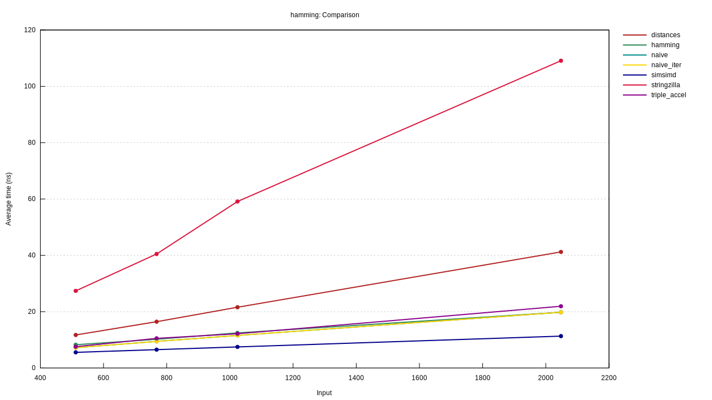

# Rust Hamming Distance Benchmark

This benchmarks various Hamming distance implementations in Rust:

- [`bitarray`](https://crates.io/crates/bitarray) 
- [`distances`](https://crates.io/crates/distances) 
- [`hamming`](https://crates.io/crates/hamming) 
- [`simsimd`](https://crates.io/crates/simsimd) 
- [`stringzilla`](https://crates.io/crates/stringzilla) 
- [`triple_accel`](https://crates.io/crates/triple_accel) 

## Running the benchmark

```sh
cargo bench
```

Then open the `target/criterion/report/index.html` file in your browser to view the results.

## Results

These were the results running on a 2023 MacBook Pro M2 Max:

1. 🥇 [`simsimd`](https://crates.io/crates/simsimd)
2. 🥈 [the naive implementation!](./src/naive.rs)
3. 🥉 [`hamming`](https://crates.io/crates/hamming)


