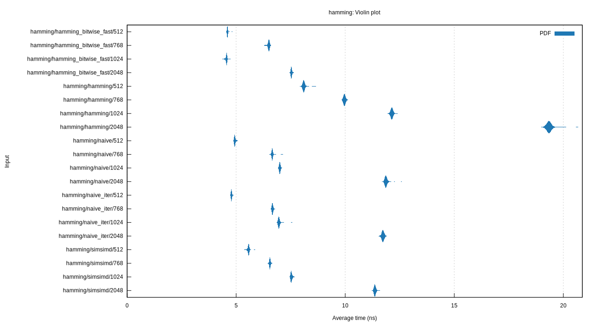
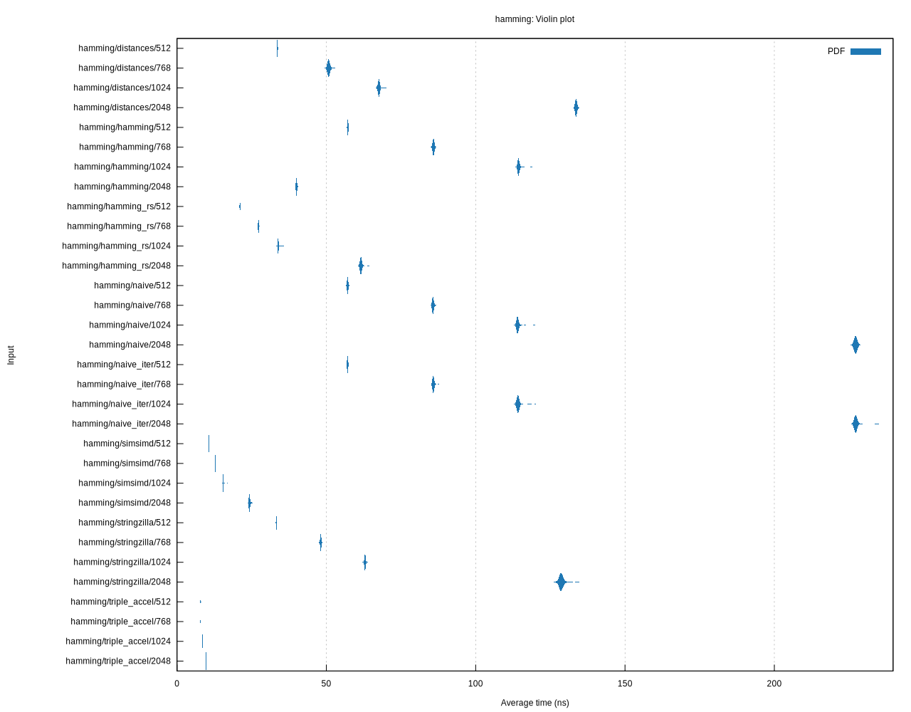
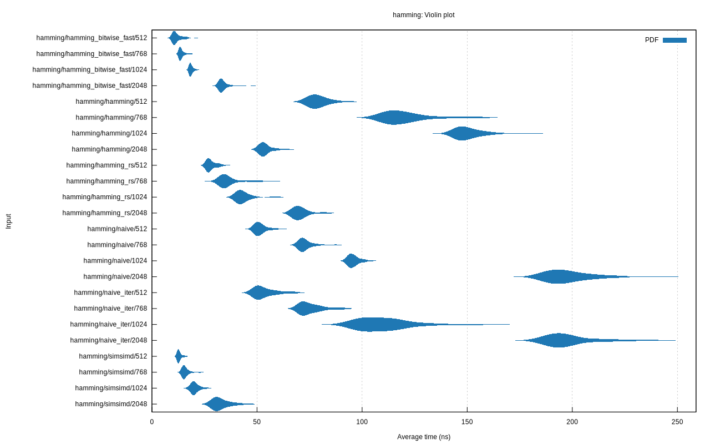

# Hamming Bitwise Fast

> A fast, zero-dependency implementation of bitwise Hamming Distance using
> a method amenable to auto-vectorization.

This started out as a benchmark of various bitwise Hamming distance implementations in Rust.
However, after finding that a simple implementation that is amenable to auto-vectorization
was comparable, if not faster, than other implementations, I decided to publish it as a crate.

**Note:** This is for comparing bit-vectors, _not_ for comparing strings.

## Usage

```rust
use hamming_bitwise_fast::hamming_bitwise_fast;

assert_eq!(hamming_bitwise_fast(&[0xFF; 1024], &[0xFF; 1024]), 0);
assert_eq!(hamming_bitwise_fast(&[0xFF; 1024], &[0x00; 1024]), 1024);
```

## Benchmarks

This uses [Criterion](https://github.com/bheisler/criterion.rs) to benchmark various Hamming distance implementations:

- The auto-vectorized implementation in this crate
- A naive for-loop based implementation
- A naive iterator based implementation
- [`hamming`](https://crates.io/crates/hamming) 
- [`hamming_rs`](https://crates.io/crates/hamming_rs) 
- [`simsimd`](https://crates.io/crates/simsimd) 

### Running the benchmark

```sh
cargo bench
```

Then open the `target/criterion/report/index.html` file in your browser to view the results.

### Results

These were the results running on 3 different types of machines:

### 2023 MacBook Pro M2 Max




### Linode 2 CPU 4GB




### Fly.io 2 CPU 4GB




## License

This project is licensed under either of the following licenses, at your option:

- [Apache License, Version 2.0](LICENSE-APACHE)
- [MIT License](LICENSE-MIT)

Unless you explicitly state otherwise, any contribution intentionally submitted for inclusion in this project by you, as defined in the Apache-2.0 license, shall be dual licensed as above, without any additional terms or conditions.
