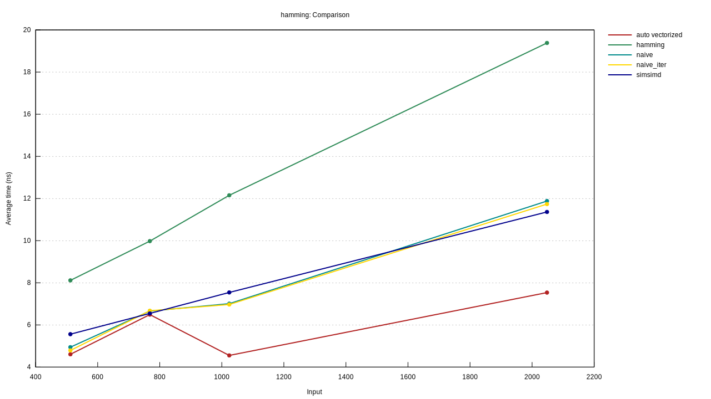
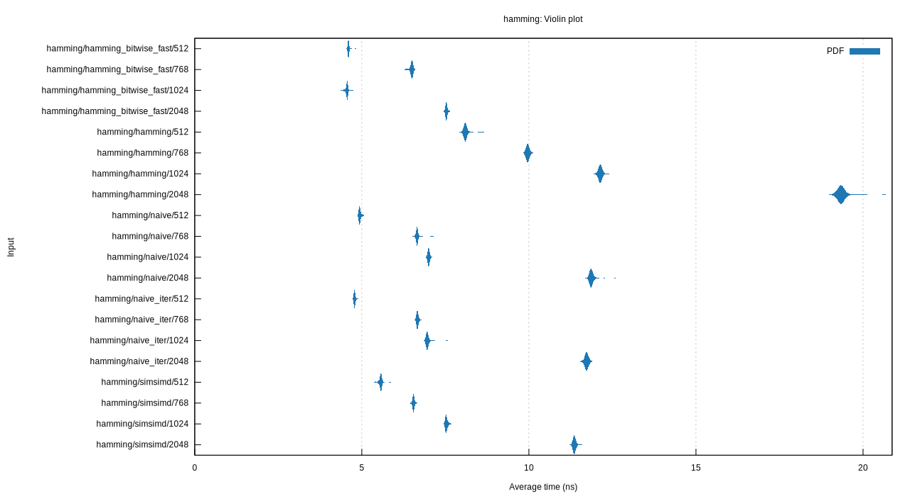
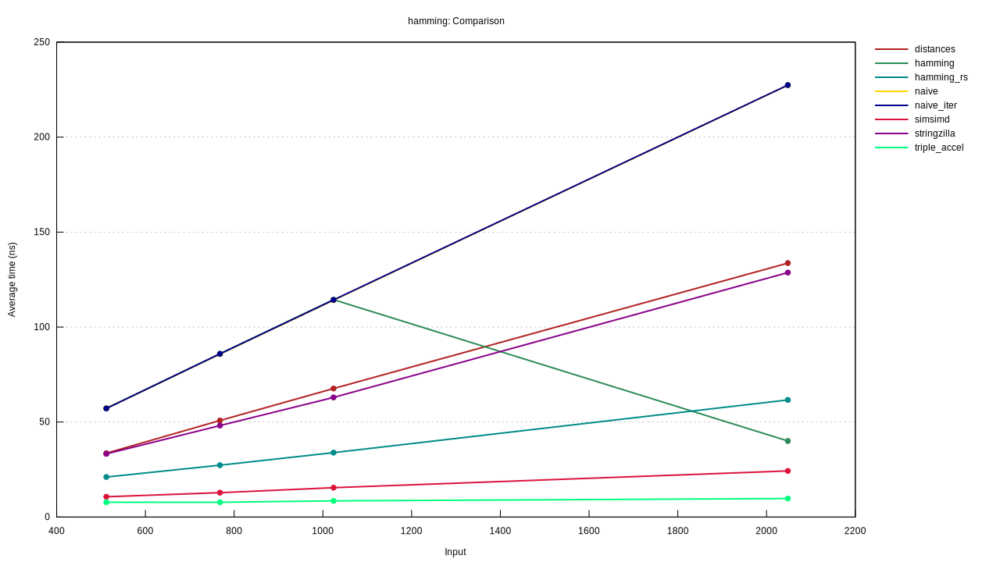
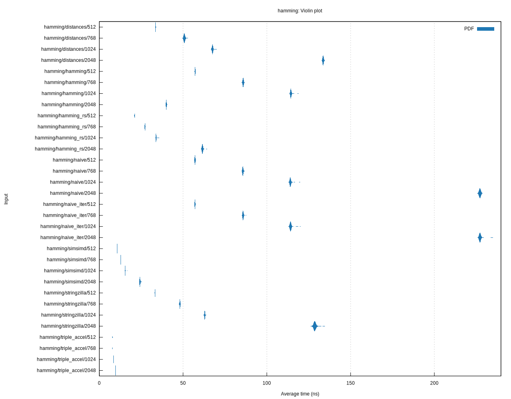
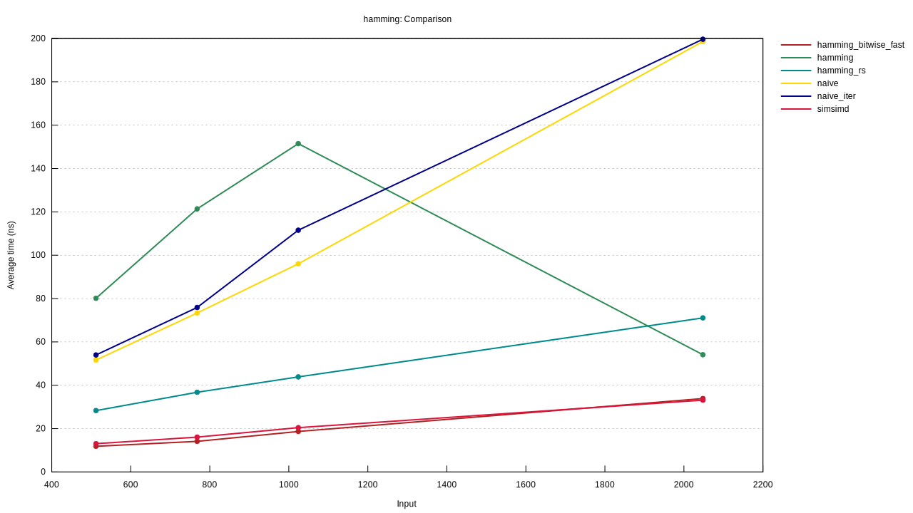
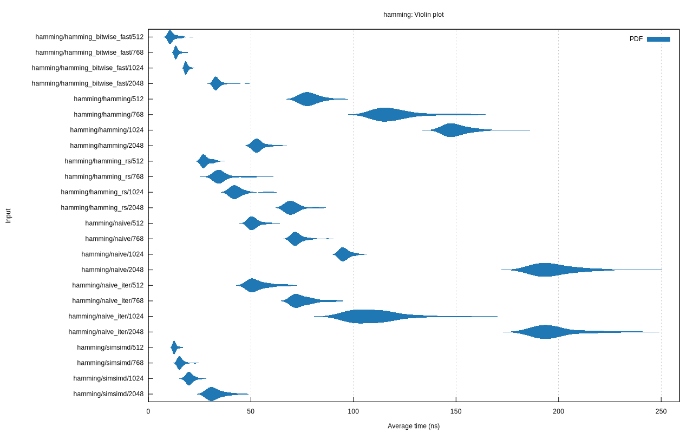

# Hamming Bitwise Fast

> A fast, zero-dependency implementation of bitwise Hamming Distance using
> a method amenable to auto-vectorization.

This started out as a benchmark of various bitwise Hamming distance implementations in Rust.
However, after finding that a simple implementation that is amenable to auto-vectorization
was comparable, if not faster, than other implementations, I decided to publish it as a crate.

**Note:** This is for comparing bit-vectors, _not_ for comparing strings.

## Usage

For variable-length slices:
```rust
use hamming_bitwise_fast::hamming_bitwise_slice;

assert_eq!(hamming_bitwise_slice(&[0xFF; 128], &[0xFF; 128]), 0);
assert_eq!(hamming_bitwise_slice(&[0xFF; 128], &[0x00; 128]), 1024);
```

For fixed-size arrays (10-100% faster for sizes under 2048 bits / 256 bytes):
```rust
use hamming_bitwise_fast::hamming_bitwise_array;

let a: [u8; 128] = [0xFF; 128];  // 1024-bit embedding
let b: [u8; 128] = [0x00; 128];
assert_eq!(hamming_bitwise_array(&a, &b), 1024);
```

For batch comparisons (one source vs many targets):
```rust
use hamming_bitwise_fast::hamming_bitwise_batch;

let source: [u8; 128] = [0; 128];
let targets = vec![[0xFF; 128], [0; 128]];
let mut distances = vec![0u32; 2];
hamming_bitwise_batch(&source, &targets, &mut distances);
assert_eq!(distances, vec![1024, 0]);
```

## Performance

| Function | Best for | Why |
|----------|----------|-----|
| `hamming_bitwise_array` | Fixed-size embeddings < 256 bytes | Compile-time size enables loop unrolling |
| `hamming_bitwise_slice` | Variable-length or large (≥256 byte) data | Simpler API; performance matches array at large sizes |
| `hamming_bitwise_batch` | One-to-many comparisons | Amortizes function call overhead |

On x86, enable the `multiversion_x86` feature for runtime CPU dispatch to AVX-512/AVX2.

## Benchmarks

This uses [Criterion](https://github.com/bheisler/criterion.rs) to benchmark various Hamming distance implementations:

- The auto-vectorized implementation in this crate
- A naive for-loop based implementation
- A naive iterator based implementation
- [`hamming`](https://crates.io/crates/hamming) 
- [`hamming_rs`](https://crates.io/crates/hamming_rs) 
- [`simsimd`](https://crates.io/crates/simsimd) 

### Running the benchmark

```sh
cargo bench
```

Then open the `target/criterion/report/index.html` file in your browser to view the results.

### Results

These were the results running on 3 different types of machines:

### 2023 MacBook Pro M2 Max




### Linode 2 CPU 4GB




### Fly.io 2 CPU 4GB




## License

This project is licensed under either of the following licenses, at your option:

- [Apache License, Version 2.0](LICENSE-APACHE)
- [MIT License](LICENSE-MIT)

Unless you explicitly state otherwise, any contribution intentionally submitted for inclusion in this project by you, as defined in the Apache-2.0 license, shall be dual licensed as above, without any additional terms or conditions.
