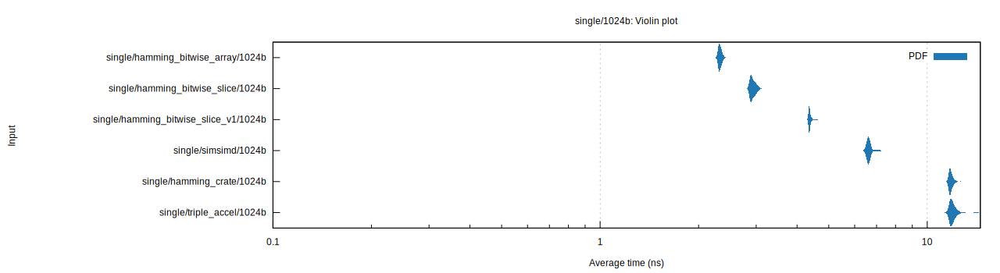
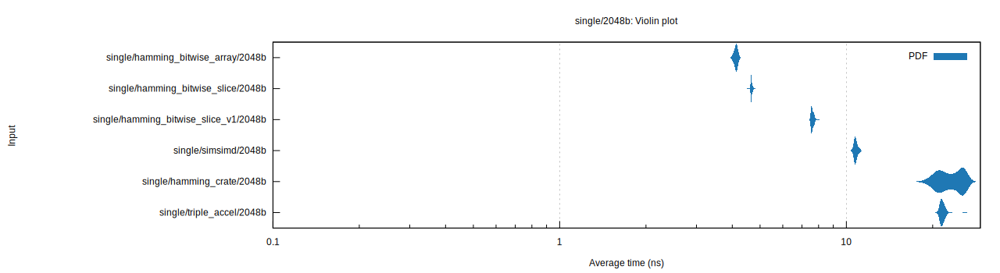
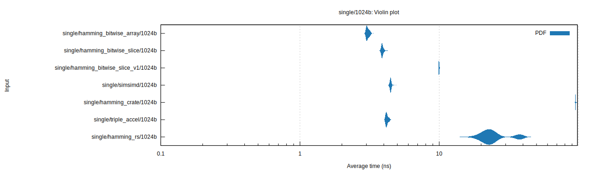
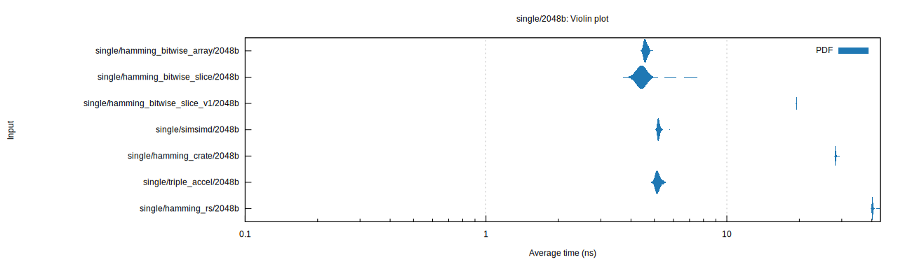
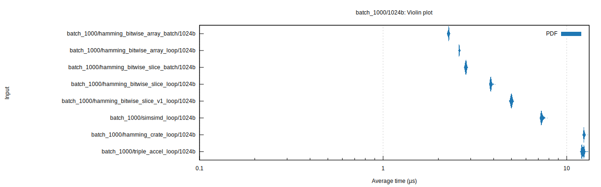
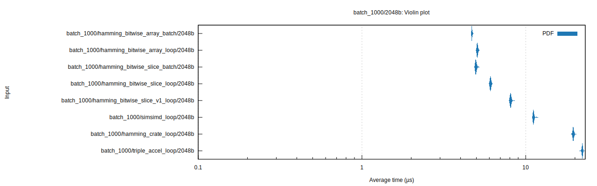
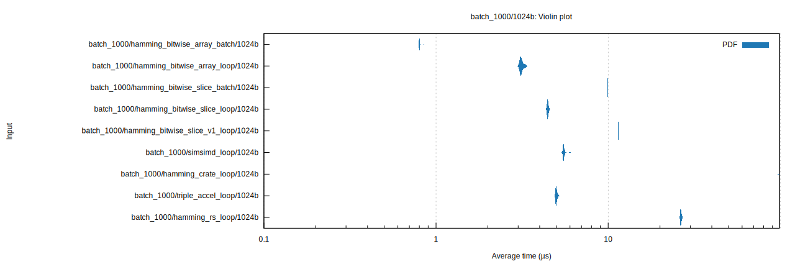
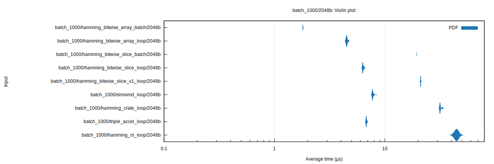

# Hamming Bitwise Fast

> A fast, zero-dependency\* implementation of bitwise Hamming Distance using
> a method amenable to auto-vectorization.

This started out as a benchmark of various bitwise Hamming distance implementations in Rust.
However, after finding that a simple implementation that is amenable to auto-vectorization
was comparable, if not faster, than other implementations, I decided to publish it as a crate.

**Note:** This is for comparing bit-vectors, _not_ for comparing strings.

_\* Zero dependencies by default. The optional `multiversion_x86` feature adds the [`multiversion`](https://crates.io/crates/multiversion) crate for runtime CPU detection on x86. See [SIMD on x86](#simd-on-x86) for details._

## Usage

For variable-length slices:
```rust
use hamming_bitwise_fast::{hamming_bitwise_slice, hamming_bitwise_slice_batch};

// Single comparison
let a: Vec<u8> = vec![0xFF; 128];
let b: Vec<u8> = vec![0x00; 128];
let distance: u32 = hamming_bitwise_slice(&a, &b); // 1024

// Batch comparison (one source vs many targets)
let source: Vec<u8> = vec![0x00; 128];
let targets: Vec<&[u8]> = vec![&a, &b];
let mut distances: Vec<u32> = vec![0; 2];
hamming_bitwise_slice_batch(&source, &targets, &mut distances); // [1024, 0]
```

For fixed-size arrays (faster for sizes under 2048 bits / 256 bytes):
```rust
use hamming_bitwise_fast::{hamming_bitwise_array, hamming_bitwise_array_batch};

// Single comparison
let a: [u8; 128] = [0xFF; 128];  // 1024-bit vectors
let b: [u8; 128] = [0x00; 128];
let distance: u32 = hamming_bitwise_array(&a, &b); // 1024

// Batch comparison (one source vs many targets)
let source: [u8; 128] = [0x00; 128];
let targets: Vec<[u8; 128]> = vec![a, b];
let mut distances: Vec<u32> = vec![0; 2];
hamming_bitwise_array_batch(&source, &targets, &mut distances); // [1024, 0]
```

## Performance

| Function | Best for | Why |
|----------|----------|-----|
| `hamming_bitwise_array` | Fixed-size embeddings < 256 bytes | Compile-time size enables loop unrolling |
| `hamming_bitwise_slice` | Variable-length or large (≥256 byte) data | Simpler API; performance matches array at large sizes |
| `hamming_bitwise_array_batch` | One-to-many array comparisons | Amortizes function call overhead |
| `hamming_bitwise_slice_batch` | One-to-many slice comparisons | Amortizes function call overhead |

## SIMD on x86

> **TL;DR:** On x86, enable the `multiversion_x86` feature for best performance:
> ```sh
> cargo add hamming-bitwise-fast --features multiversion_x86
> ```

### The Problem

Rust targets the baseline [x86-64 microarchitecture level](https://en.wikipedia.org/wiki/X86-64#Microarchitecture_levels) (v1) by default, which only includes SSE2. This ensures binaries run on any x86-64 CPU made since 2003, but misses major SIMD improvements that can make Hamming distance **4-5x faster**:

| Level | Year | Key Features |
|-------|------|--------------|
| x86-64-v1 | 2003 | SSE2 (baseline) |
| x86-64-v2 | 2008 | SSE4.2, POPCNT |
| x86-64-v3 | 2013 | AVX2, BMI1/2 |
| x86-64-v4 | 2017 | AVX-512 |

**Note:** The `VPOPCNTDQ` instruction (vectorized popcount) that makes Hamming distance extremely fast is a *separate* AVX-512 extension, not part of the base x86-64-v4 level. It's available on Ice Lake (2019) and later CPUs. The `multiversion_x86` feature automatically detects and uses it when available.

### The Solution: `multiversion_x86`

The `multiversion_x86` feature uses the [`multiversion`](https://crates.io/crates/multiversion) crate to compile multiple code paths and select the fastest one at runtime via CPUID:

```toml
[dependencies]
hamming-bitwise-fast = { version = "1", features = ["multiversion_x86"] }
```

This gives near-optimal performance on any x86 CPU without risking "illegal instruction" crashes.

### Alternative: Compile-time CPU targeting

If you know your target CPU, you can use `RUSTFLAGS` for slightly better performance (no runtime dispatch overhead):

```sh
# Best performance, but binary only runs on identical CPUs
RUSTFLAGS="-C target-cpu=native" cargo build --release

# Requires AVX2 (2013+ CPUs)
RUSTFLAGS="-C target-cpu=x86-64-v3" cargo build --release

# Requires AVX-512 base (2017+ server CPUs)
RUSTFLAGS="-C target-cpu=x86-64-v4" cargo build --release

# Requires AVX-512 with VPOPCNTDQ (Ice Lake 2019+) - fastest for Hamming distance
RUSTFLAGS="-C target-cpu=icelake-server" cargo build --release
# Or explicitly enable the feature on any AVX-512 base:
RUSTFLAGS="-C target-cpu=x86-64-v4 -C target-feature=+avx512vpopcntdq" cargo build --release
```

> ⚠️ **Warning:** Binaries built with compile-time CPU targeting will crash with "illegal instruction" if run on a CPU that doesn't support the required features. For portable deployments, use the `multiversion_x86` feature instead.

### Performance comparison

| Option | Speed (1024-bit) | Trade-off |
|--------|------------------|-----------|
| Default | ~9ns | Maximum portability, but slow |
| `multiversion_x86` feature | ~4ns | Fast on any x86 CPU (recommended) |
| `-C target-cpu=native` | ~2ns | Fastest, but binary only runs on build machine |

**For Docker/cloud deployments**, `multiversion_x86` is strongly recommended—it automatically uses AVX-512 on modern cloud instances while remaining compatible with older hardware.

## Benchmarks

Comparing `hamming_bitwise_array`, `hamming_bitwise_slice`, and batch APIs against competitor crates:
- [`simsimd`](https://crates.io/crates/simsimd) 
- [`hamming`](https://crates.io/crates/hamming) 
- [`triple_accel`](https://crates.io/crates/triple_accel) 
- [`hamming_rs`](https://crates.io/crates/hamming_rs)  (x86 only)

### Single Comparison

#### MacBook Pro M2 Max (ARM)

##### 1024-bit


##### 2048-bit


#### Linode x86 (with `multiversion_x86` feature)

##### 1024-bit


##### 2048-bit


### Batch Comparison (1000 comparisons, divide time by 1000)

#### MacBook Pro M2 Max (ARM)

##### 1024-bit


##### 2048-bit


#### Linode x86 (with `multiversion_x86` feature)

##### 1024-bit


##### 2048-bit


### Running benchmarks

```sh
# Run all benchmarks
cargo bench

# Run only 1024b and 2048b competitor benchmarks
cargo bench --bench q5_vs_competitors -- "1024b|2048b"

# With multiversion (x86 only)
cargo bench --features multiversion_x86 --bench q5_vs_competitors -- "1024b|2048b"
```

Then open `target/criterion/report/index.html` to view the results

## License

This project is licensed under either of the following licenses, at your option:

- [Apache License, Version 2.0](LICENSE-APACHE)
- [MIT License](LICENSE-MIT)

Unless you explicitly state otherwise, any contribution intentionally submitted for inclusion in this project by you, as defined in the Apache-2.0 license, shall be dual licensed as above, without any additional terms or conditions.
